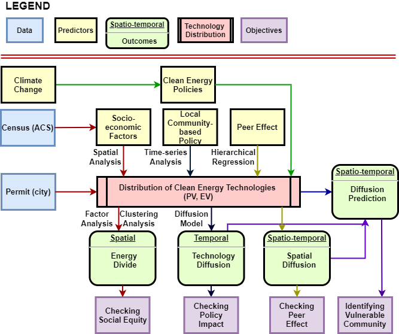

```{r setup, include=FALSE}
knitr::opts_chunk$set(echo = TRUE,warning=FALSE, message=FALSE)
```

# Research Overview {#index}

## Abstract 

The recent climate change has led to the development of various clean energy polices and technologies. As a result, the current rapid transition of energy systems leading to uneven distribution due to the development, has the potential to significantly impact on how communities respond to any undesirable climate-related events. Uneven distribution of the new energy systems could be described as "energy divide" (inequalities in access to energy services) which is the similar to "digital divide" in the late 20th century where uneven distribution of telecommunication infrastructure caused social equity issue where social equity is defined as equal opportunities to different people living in different places. Clean energy technologies are proved to increase resiliency in response to the interuption from climate change. While there are benefits to adopt and expand the clean energy technololgies, there are concerns about electrical load balancing due to the intermittent power generation and uncertain charging schedules of clean energy technologies such as photovoltaic (PV) and electric vehicle (EV). Especially regions with higher decentralization trend needs attention due to lack of active generation and demand connected. In this regard, this proposal aims to study diffusion dynamics of clean energy technologies (PV and EV) on residential built environments to help policy makers to better support underserved communities under limited resources by devising equitable clean energy policies while promoting distribution in consideration of appropriate boundaries of reliable electrical system in regard to clean energy technologies. The objectives of the proposed research include (1) to investigate the current status of distibution of clean energy technologies (PV and EV) and their relationship with socio-economic characteristics; (2) to validate policy interruption impact on diffusion; (3) to identify peer effect on diffusion of clean energy technologies; and (4) to develope a robust prediction model in consideration of the identified significant factors to find out the most vulnerable communities in response to the uneven distribution in spatio-temporal aspects.  

## Research Objectives 

* Investigating social equity due to the uneven distribution of clean energy technologies
* Verifying policy impact on clean energy technology diffusion 
* Identifying Peer effect on clean energy technology diffusion 
* Developing a model to identify vulnerable communities with the uneven distribution in spatio-temporal aspects 




# Social Equity in Clean Energy Policies 

## Introduction

<!-- 
**Key Words:**

* Climate change causing clean energy policies
* Rapid transition to a new enery systems 
* Uneven distribution of new energy systems 
* Energy divide (e.g. digital divide)
* Social equity --> 

###  Energy divide 

Clean energy technologies (e.g., PV and EV) have been introduced and utilized all over the world seeking more reliable and sustainable energy systems in response to climate change. For instance, solar panel installations have increased on residential, commercial buildings and utility-scale farms encouraged by clean energy policies and incentives such as federal tax credits. This rapid transition to the new energy system could lead to undesirable impacts on some communities as shown in the case of telecommunication where the digital divide has excluded vulnerable groups of people from knowledge-based societies and economies (Chen and Wellman 2004). If these deeply transformative changes in the power sector are not handled properly, an emerging electrical divide like the digital divide could appear (Caperton et al. 2013). In fact, European Union (EU) has already experienced that the uneven deployment of energy poverty and social distribution are correlated where spatial and social distribution is highly uneven (Bouzarovski and Tirado Herrero 2017). Committed leadership to implement a new policy in regard to the transition is required to avoid the uneven distribution of the power service.

### EV charging distribution 

Most charging occurs at home and 50% of EV users charge exclusively at home (Smart 2015). Accommodating home charging opportunities would contribute to EV adoption similar to the case of rooftop solar, where 49% of households are not able to install the solar system due to not owning the building, living in multi-family unit, and lack of roof space (Feldman 2015). In this context, it is necessary to review how residential charging infrastructures are spatially distributed to understand how clean energy policies and incentives have been implemented. This may identify an issue related to social equity; uneven distribution may indicate particular communities being left out of using clean energy technologies, particularly those more vulnerable to the climate change. 

### Equity concerns

The previous empirical analyses confirm that currently, there are communities left out from the benefit of one of clean energy technologies, PV and EV. This raises an issue on social justice. From the utilitarian perspective, it is more efficient to use limited resources to maximize the global benefits thus, current distribution of clean energy technologies as a result of the present clean energy policies, seems to get along with this principle as opposed to the social justice. In short, current clean energy policies or incentives are based on utilitarian principle. For example, rebates, tax credits, production performance credits, property tax exemptions, and sale tax exemptions are for those who are able to finance solar systems in addition to possessing their own houses. Opportunities to take part in the incentives are hard for those who can’t afford clean energy technologies.

## Methodology 

While a number of studies have investigated various aspects of the policies designed to support PV and EV charger installations, there is still a dearth of studies aimed at investigating the impact of such policies on social equity. Two unanswered questions have emerged: (1) were there certain communities inadvertently left out from incentive opportunities? and (2) do those current policies help to encourage the social equity in clean energy technologies? To answer these questions, the present empirical study aimed to perform a spatial analysis of the distribution of PV and EV charger installed-buildings in terms of housing and socioeconomic characteristics based on the census tracks of Seattle, WA. In particular, this study explored patterns of the residential (single family and multifamily) regarding PV and EV charger by examining spatial clustering, associations among variables through several data sources. The examined data entails the socioeconomic and housing characteristics based on the American Community Survey of the census.

This study focuses on the City of Seattle open data portal which keeps the records of electrical permits issued between 2003 and 2018 in Seattle. Electrical permits are required when residential houses want to install PV and EV chargers on their properties. The present study employed advanced data mining techniques to identify residential PV and EV charger installation among the data sets. The data include geographical coordinates (latitudes and longitudes), dates of the PV and EV charger installations, and PV and EV charger contractors who installed the systems. Mapping the points of residential PV and EV charger in the region allows to verify a certain pattern in the installations. The densities of the data points, normalized by the density of the total households shows a clustered pattern, where the value means scaled density value. 

* Task1: Map clean energy technologies (i.e. PV and EV) to verify distribution pattern
* Task2: Find the latent variables using Factor analysis
* Taks3: Verify the suitability of the latent variables using clustering analysis 
* Task4: Find the relationship between distirubtion pattern and the latent variables using spatial autocorrelation regression model 
* Task5: Find the sensitive communities to each latent variables using GWR 

<!-- Point patterns could be identified by G estimation which could be compared with complete spatial randomness (CSR). The G estimation function (EDF) of the nearest neighbor distances is defined: di represents the distance from the i-th event to the nearest other event in A and n is the number of points. It simulated with 99 realizations under the null (resampling from n points) and formed the G estimate for each set, and produced Monte Carlo envelopes. The estimates being off the envelopes indicates the distribution of PV and EV chargers is far from randomness. After point data was aggregated to the related census tracks, the data was examined in terms of the socioeconomic and housing characteristics based on the American Community Survey (ACS) of the census (2011 - 2015 ACS 5-Year estimates). The rate of the PV and EV charger installations in each census track is the dependent variable in this study. Rest of variables are the proportions given census tracts. -->

The expected rate of residential PV and EV charger per each census track is estimated based on the total number of housing units in Seattle and its residential PV and EV charger numbers. Standardized Installation Ratio (SIR) is defined by the number of residential PV and EV chargers over the expected number of residential PV and EV chargers given the estimated proportion. In this context, SIR refers to the total number of residential PV and EV charger over the total number of housing units in Seattle. The distribution of each census tract SIR shows a clustered pattern similar to that of the previous point data of residential PV and EV chargers.

$$ SIR_i = \frac{Y_i}{E_i} $$

<!-- 
The residential PV and EV charger rate is assumed to be associated with a Poisson count model considering its rare proportion with respect to the denominator (the total housing units) in a census track in addition to the fact that the number of residential PV and EV chargers itself, is count data. The residuals, after fitting the Poisson model, show clustering with the similar pattern of SIR distribution across census tracks. This indicates that there is strong evidence of spatial dependency among the regions in Seattle. -->

A Moran’s I test identified global clustering in the distribution of the rates of residential PV and EV charger with a very small p-value with the test statistic. This confirms that the residential PV and EV charger rate across census tracks is clustered. This clustering trend can be alleviated by fitting a model with appropriate covariates with the similar characteristics. For that, socioeconomic and housing characteristics were examined to identify the most proper covariates. Having verified that there is a spatial pattern in the residential PV and EV charger rate, there might be related or shared factors in the socioeconomic and housing characteristics of the same region. It shows that housing, economy, and social inequality variables pairwise correlations.

<!-- 
Dimension reduction of covariates was performed by a factor analysis in consideration of avoiding multicollinearity. The newly generated factors were fitted to models to estimate the residential PV and EV charger rates. Residuals were checked afterwards to see if there is still a clustered pattern. If there is still a clustered pattern, it means that the model does not address the spatial dependency. The factor analysis identifies the similar variables in terms of housing unit structures (single/multi-family house unit), housing ownership types (rent/owned), economic status (income levels and housing values), and inequality index. Housing unit structures show the similar trend of housing tenure while housing median value, high income class proportion, and household median incomes follow the similar pattern representing economic status. Residential PV and EV charger rates and the factors from the dimension reduction show strong correlations. Generalized log-linear model (GLM) fits the data based on the factors, ML1, ML2 and ML3 without consideration of the spatial autocorrelation. Note that ML3, which was negatively correlated with the PV and EV charger rates, becomes positively correlated after the model fit because predictors, ML1 and ML2 affected ML3 in the model. -->

K-means clustering analysis, afterward, identifies similar regions in terms of socio-economic and housing patterns in census tracks. It should be noted that K-means clustering does not take into account the PV and EV charger rates for defining the Euclidean distance among data points, thus the clustered groups are determined only by the three predictors, ML1, ML2 and ML3. This will help to see the difference between the clustered groups and PV and EV charger rates.  

A Poisson lognormal spatial model, especially using BYM2 method, is tested to address any residual clustering issues using Bayesian method, Integrated Nested Laplace Approximations (INLA), which combines Laplace approximations and numerical integration in a very efficient manner. INLA enables Generalized Linear Mixed Models (GLMMs) addressing temporal and spatial error terms. An Intrinsic Conditional Auto-Regressive (ICAR) model addressed spatial autocorrelation. 

$$
\begin{aligned}
Y_i |\beta_{0},\beta_{1},\beta_{2},\beta_{3},S_i,\epsilon_i & \sim_{ind} \mbox{Poisson}(E_i \mbox{e}^{\beta_{0}+\beta_{1}X_{1i}+\beta_{2}X_{2i}+\beta_{3}X_{3i}} \mbox{e}^{S_i + \epsilon_i}),\\ 
\epsilon_i | \sigma_\epsilon^{2} & \sim_{iid} \mbox{N}(0,\sigma_\epsilon^{2}),\\ 
S_1,...,S_n | \sigma_s^{2} & \sim ~~~ \mbox{ICAR}(\sigma_s^{2}). 
\end{aligned} 
$$

Finally Geographically weighted regression (GWR) is used to address the local variation of coefficients of predictors by taking into account the local spatial dependency in order to locate regions more sensitive to each predictor.

$$
\begin{aligned}
Y(s) = E(s)\mbox{e}^{(\beta_{0}+\beta_{1}(s)X_1(s)+\beta_{2}(s)X_2(s)+\beta_{3}(s)X_3+\epsilon(s))}
\end{aligned} 
$$


## Result and Contribution (on going)

Empirical analyses of residential PV and EV chargers in Seattle, WA, revealed that (1) there is a clustered pattern in the distribution of the clean energy technologies installations, (2) housing stability and economic status explain the uneven distribution, and (3) some neighbors are more sensitive to the economic status and housing stability in terms of installations. The study results revealed social equity issues based on the uneven distribution, i.e., certain communities are underserved for the clean energy technologies. The study results will help policy makers to better support any underserved communities under limited resources (e.g., those who rent houses and have less finance for PV and EV and charger) by devising equitable clean energy policies in response to clean energy technologies.

Current uneven distribution of clean energy technologies are presenting social equity issue. The most significant factors to the uneven distribution were identified: economic status and housing stability. Spatial autocorrelation and clustering issue were addressed by the ICAR model. Furthermore this research found that socio-economic data from Sensus could be used as predictors to estimate the distribution of clean energy technologies for other regions. Finally, sensitive communities to the identified factors were identified for policy makers to address social equity for effective and even distribution of clean energy technologies. 


# Policy Impact/ Peer Effect on Diffusion (PV, and EV)

## Introduction 

<!-- 
**Key Words:**

* Clean energy policies, and campaigns 
* Policy and campaign impact on diffusion trend by region
* Peer effects on diffusion in spatio-temporal aspect
* Diffusion models (new adopter model, e.g. Bass) --> 

### Washington clean energy policies 

Clean Energy Transformation Act (CETA) was signed into law by the Governor of Washington in 2019 to get rid of greenhouse gas emission from an electricity supply by 2045. It plans to eliminate coal power plants by 2025, at least 80% of electricity should be renewable or non-emitting while up to 20% could be alternative compliance option, and finally 100% of electricity should be renewable or non-emitting by 2045. There are safequards for rates, reliability, and vulnerable communities by requiring utilities to take appropriate actions. For example, RCW 19.405 aims at equitable distibution of benefits:

> “..ensure that all customers are benefiting from the transition to clean energy: Through the equitable distribution of energy and non-energy benefits and reduction of burdens to vulnerable populations and highly impacted communities; long-term and short-term public health and environmental benefits and reduction of costs and risks; and energy security and resiliency.” - RCW 19.405.030(8) states 

Furthermore, RCW 19.405.120 focuses on low-income energy assistance by requiring utilities in Washington to provide energy assistance funding and programs to low-income households from July, 2021. Energy assistance is to reduce energy burden of the customers of utilities including, but not limited to weatherization and onwership in distributed energy resources (RCW 19.405.020(15)). In this regard, Washington State Department of Commerce (DoC) will estimate the demographic characteristics of households and housing characteristics served by energy assistance funding and programs (RCW 19.405.020(3)(a)). 


### EV charging related policies 

EV charging infrastructure has a significant effect on EV adoption as one of the EV adoption challenges is range anxiety related to refueling/ recharging time, and the availability of refueling infrastructure in addition to higher price, and lack of education and awareness about EVs (Stumpf 2019). It is understood that charging opportunities should be ubiquitous, fast, and inexpensive in order to increase EV adoption. In order to encourage EV charger installation, some states established a new code requiring new multi-family construction to accommodate EV charger installation. For example, Washington State has a code WAC 51-50-0427: where parking is provided, at least 5 percent of parking spaces must have EV charging infrastructure (WA Legislature 2016). Furthermore, there are incentives to encourage adopting EVs and chargers. For example, tax exemptions are available for the labor and services rendered in respect to electric vehicle infrastructure (Revenue Washington State 2019). Moreover, as a way to encourage EV purchasing, a tax credit, ranging from \$2,500 to \$7,500, is offered by the federal (DOE 2019) while Washington State offer purchase and leasing tax exemptions, ranging from \$2,600 to \$3,100, on EVs (Banse 2018).


### Solarize Northwest 

Solarize Northwest is a community-driven, neighborhood group purchase campaign from Spark Northwest (Northwest Sustainable Energy for Economic Development), a 501(c)3 non-profit organization aimed at creating communities of locally-controlled clean energy by Solarize campaigns in cooperation with community organizations, solar contractors, utilities, city governments, and solar lenders. Communities take part in the program by attending workshops, getting site assessments, and contracting for installation. In particular, the campaign was implemented at Queen Ann in 2011 followed by other communities as below: 

* January-April 2011 Queen Anne 30 Queen Anne homes for 130 kilowatts 
* July-October 2011 Magnolia 29 Magnolia homes for 114 kilowatts 
* January-April 2012 NE 52 Northeast Seattle homes for 246 kilowatts 
* January-April 2013 NW 141 Northwest Seattle homes for 640 kilowatts 
* July-October 2013 Central/ SE 185 homes for 885 kilowatts 
* July – October 2014 SW 111 homes for 684 kW

### Peer effects 
Economic incentive difference influences the spatial and temporal patterns of PV adoption while significant spatial spillover effects were found between neighboring counties (Dharshing 2016). Neighboring effect on diffusion of clean energy technologies could be discussed in terms of peer effects which refer to externalities in which the chacteristics or actions of a reference group affect an individual's behaviour or outcomes (Ryan 2017). Peer effects on diffusion of clean energy technologies could be investigated by the spiilover effects between neighboring communities or in terms of individual's surrounding local built environments. In particular, PV is normally installed on the rooftop, visibility of PV could affect neighbor's decision on PV adoption. In this regard, visibility of clean energy technologies could be considered to be passive peer effects while positive word of mouth is categorized to active peer effects. Both of active and passive peer effects were found to influence PV adoption in Texas (Rai et al. 2013). 


## Methodology 

Washington State CETA features social justice and assistance to low-income housholds. It aims at not only equitable distribution of benefits, reduction of burdens to vulnerable communities, but also public health, environmental benefits, and energy resilience. Furthermore, CETA requires that all utilities in the state implement energy assistance funding and programs to low-income households by means of bill reductions and weatherization, energy efficiency, and ownership in distributed energy resources. In this regard, it is necessary to investigate how clean energy policies, programs or campaigns affected diffusion of clean energy technologies in different communities. In particular, Solarize Northwest campaign impact on diffusion in Seattle will be investigated using time series analysis including interrupted time series (ITS). This analysis will verify the impact of the campaign on communities with respect to diffusion of PV compared to EV in Seattle. Furthermore, peer effects on diffusion of clean energy technologies will be also investigated to find out how the visibility of PV and EV influenced diffusion of the technologies. The questions are: (1) is the community-driven campaign effective to diffusion of PV and EV? and (2) did the passive peer effects of PV visibility affect diffusion in the community? 

* Task1: Find the trend of diffusion of clean energy technologies (i.e. PV and EV) for each neighborhood over the pas years 
* Task2: Indicate the policy interruption (Execusion of the campaign) on the trend of diffusion of clean energy technologies 
* Taks3: Analyze the interruption impact of the campaign to diffusion using time series models 
* Task4: Analyze the peer effects of neighboring built environments on diffusion using hierarchical regression models 
* Task5: Conclude the impact of policy interruption and peer effect on diffusion 

ITS evaluates the interventions which is appropriate for interventions introduced at a population level over a clearly defined time period and that target the reference population outcomes. This analysis is suitable for a continuous sequence of observations over time with respect to the intervention which differentiates pre-intervention and post-intervention period. The outcome should be available after the intervention and the time intervals should be equally spaced over time. Two models are used for single group and multiple groups. Single group analysis aims at impact of the intervention on diffusion of PV in Seattle while multiple group analysis targets the same goal while employing EV or diffusion trend of PV on other community as a control group to verify the impact of the intervention. 

$$
\begin{aligned}
Y_t = \beta_{0}+\beta_{1}T_t+\beta_{2}X_t+\beta_{3}T_tX_t+\epsilon_t,
\end{aligned} 
$$

where, T = the time elapsed since the start of the study; X = a dummy variable indicating the pre‐ or the post‐intervention period ;Y= the outcome at time;$\epsilon$ = estimates the error; $\beta_0$ = estimates the base level of the outcome at the beginning 
of the series; $\beta_1$ = estimates the base trend; $\beta_2$ = estimates the change in level in the post‐intervention segment; $\beta_3$ = estimates the change in trend in the post‐intervention 
segment.

$$
\begin{aligned}
Y_t = \beta_{0}+\beta_{1}T_t+\beta_{2}X_t+\beta_{3}T_tX_t+\beta_{4}Z+\beta_{5}ZT_t+\beta_{6}ZX_t+\beta_{7}ZT_tX_t+\epsilon_t
\end{aligned} 
$$

where, Z = dummy variable for group; $\beta_4$ = difference between the groups at the beginning time point; $\beta_5$ = difference between the groups in prior trend; $\beta_6$ = difference between the groups in change in level; $\beta_7$ = difference between the groups in change in trend. 


## Result and Contribution (expected)

The identified local community based program is found to significantly influence the diffusion trend. Sptio-temporal peer effects are significant for diffusion as well. The most significant factors to the diffusion are identified and compared (local community-driven campaign and peer effects). Diffusion models are suggsted on PV and EV adoption in Seattle. This will confirm the importance of community involvement and peer effects on diffusion of clean energy technologies. Policy makers can increase diffusion of desired clean energy technologies while saving the acquisition cost. 


# Identifying Vulnerable Communities with Uneven Distribution in Spatio-Temporal Aspect

## Introduction 

<!-- 
**Key Words** 

* Resilient energy system in regard to decentralizatoin and diversification 
* Different diffusion patterns between PV and EV and by communities 
* Having large amount of variable renewable sources leading to reliability issue on Grid requiring development of storage and demand-side solutions
* Attention to communities with higher decentralization trend due to load balancing --> 

### Reliability of energy supply 

Reliability of energy supply has proven to be important especially during emergency situations when, for example, medical services are in high demand. Furthermore, about 1.1 billion people lack access to electricity and 52 billion USD annual investment is needed for the Sustainable Development Goals (SDGs) (IEA 2017). Lack of electricity affects more vulnerable people such as patients. Hurricane Maria caused additional deaths in Puerto Rico, especially to those who relied on respirators powered by electricity in 2017 (Robles et al. 2017). It is known that Maria incurred the longest blackout with more than 100 days in the US history (Irfan 2018). Respiratory patients are more vulnerable to power outages that mortality and respiratory hospital admissions increased significantly during the blackout (Lin et al. 2011). These studies and reports show that reliable power supply is essential to those vulnerable communities.

To address climate change which is affecting people, it is necessary to have reliable energy services evenly distributed to all over the communities, particularly to those more vulnerable. Decentralized energy system is more reliable in terms of energy access and the low carbon challenges (Goldthau 2014). For example, micro-grids (decentralized energy system) at community level lead to more robust power systems (Wang and Reed 2017). Integration of interdependent infrastructures including, but not limited to energy, water, and telecommunication, also bring out the better mitigation in response to extreme weather (Zimmerman et al. 2017).

### Definition of resilience

Climate change and its impact on urban systems have raised questions of how to improve resilient systems especially the ones related to energy. Some of researchers introduced indexes related to resilience for analyses, and the others created mathematical functions to interpret the current phenomenon and simulated to prove their hypotheses. Energy resilience research is still at its emerging stage that a few literatures have tried to define energy resilience. First, the common definition of resilience could be discussed in terms of resilience abilities (preparation, absorption, recovery, and adaptation). It is also addressed in terms of sustainability related dimensions (availability, accessibility, affordability, and acceptability). “Preparation” in resilience ability and “availability” in sustainable dimension are considered to be the most critical to address energy resilience (Sharifi and Yamagata 2016). “Preparation” involves early adoption of planning and design measures to avoid potential disruptions. Preparation measure is known to be the most effective to improve the resilience. Furthermore, reserve margins, diverse energy sources, and monitoring systems could improve “availability” of energy services.

### Definition of vulnerability

Vulnerability could be defined as being at risk of having limited capacity of power to protect one’s interest. Vulnerability is, however, mainly interpreted in connection with weakness, dependency, powerlessness, deficiency, and passivity. This implicit bias leads to a problem in ethical response as it entails negative connotation (Gilson 2013). Vulnerability could be interpreted in two sources - “inherent” and “situational” (Mackenzie 2013). Our neediness and dependence on others incur inherent vulnerability. This applies to energy dependency in the modern society because energy is essential to the basic human needs to sustain life. Situational vulnerability is context dependent such that negative impact of energy poverty on a certain community, would be different from the impact on other communities, depending upon social, political, economic, and environmental situations. For example, effects of a same hurricane would be less in a community, which has more resilient energy systems. Thus, it is necessary to discuss characteristics of resilient energy systems in terms of energy dependency and situational conditions (social, political, economic, and environmental).

### Characteristics for resilient energy systems

Community resilience could benefit from integrated energy diversity and decentralization in terms of reliable energy supply. Two emerging characteristics for energy resilience were presented: integrated energy system (IES) and distributed energy resources (DERs) (Lin and Bie 2016). IES is related to interdependency and diversity of systems while DERs represent several renewable energy sources spread across regions. DERs could be interpreted as decentralized energy systems such as micro-grids. When systems are combined, the complexity becomes characterized and the emergent behavior of the system is hard to be expected. In the study, two measures for energy resilience were introduced: hardware hardening and operational resilience strategies. Hardware hardening happens to be costly and influences only a limited part of the whole system that is less effective. On the other hand, increasing diversity of energy supply, would increase the system resilience.

**Integrated energy system (IES)**

Understanding interdependencies of infrastructures are essential to address vulnerability. For instance, a study shows that interdependencies in infrastructures including energy, are important to a system resilience, and space and time are critical to assess hazard impact of interdependent lifeline infrastructures (Wang and Reed 2017). Furthermore, the study suggested that micro-grid at the community level, would increase robustness of the energy system in addition to hardening structure of power delivery components and increasing power generation redundancy. Robustness for power and telecommunication infrastructure was modeled in this study, in terms of resilience (Purple infra – human; Green infra – social, biological, hydrological, circulatory, and metabolic; Gray infra – lifelines; and modeling of interdependencies). Using state wide data, the study models the inoperability in terms of time (model parameters chosen by the goodness of fit). Time to recovery model estimates resource allocation pre-event. It found that peak wind speed and the corresponding parameters are not significant. Fragility models were developed by logistic regression. The same model for power was applied to telecommunication. Combined model (power and telecommunication) with the fragility model and single degree of freedom system, may predict the restoration after hurricanes. Those models could be used to predict performance of the combined infrastructure systems in response to future storms. This study argues that social science involvement may be necessary to investigate from the community perspectives in addition to the infrastructure operators’ perspectives.

**Distributed energy resources (DERs)**

Homogeneous and a sole energy production system not only adversely affects communities due to the lack of reliable energy supply, but also harms the social and environmental value of the built environment. Decentralization of energy production and supply has played an important role to resilient community as it is more robust in response to disruptions. For example, a study shows controllable and islandable micro-grid systems (decentralized systems) would improve the resiliency of power grids in extreme conditions (Shahidehpour et al. 2017). On the other hand, centralized energy production may have contributed to vulnerability of the current urban form as most of subsystems of human activities are relying on the sole energy production. The more dependent to a sole energy production, the more vulnerable a system would face interruptions.

Decentralized energy network, also, has enhanced the energy accessibility, and has been increasing due to efficient end-use appliance and low-cost photovoltaic supported by ICT (mobile phone) and virtual financial services (Alstone et al. 2015). There are still 1.3 billion people who currently lack access to electricity, and some barriers to mobilize the decentralized energy networks to local level. Governance of energy infrastructures in connection with polycentric governances will promote resilient energy systems (Goldthau 2014). It is because polycentric governances promote decentralized energy systems. Social science would be helpful to provide the reliable energy services as polycentric governance is critically related to socio-economic actors.

<!-- 
The investment of off-grid, one of the decentralized energy systems, however, features Unfavorable risk-return profiles and small investment volumes. Spatial diversity in a portfolio can reduce investment risks of private investments on resilient energy systems. Potential aggregation of small-scale renewable energy to investment is promising in that spatial diversification is helpful for derisking. Classification of risks, quantitative estimation of cost and derisking effects for aggregation of small-scale investments will help attracting private investment on off-grid. Barriers to private investment are financial, institutional and policy, and technical. Market risk could be decreased by portfolio with different geographies or industries. Systematic assessment is necessary for derisking related to regional disasters, policy change and regional industry (Malhotra et al. 2017). --> 


## Methodology 

Residential solar (PV) and electric vehicle (EV) are expected to increase, which leads to interruptions to the local electrical grid. It is because intermittent power generation from renewable energy sources and uncertainty of the local EV charging schedules will burden the independent system operator (ISO) for load balancing. In this regard, it is necessary to indentify vulnerable communities in terms of rapid increases of those clean energy technologies especially PV and EV in consideration of different rates of the technology penetrations in different communities. The questions are: (1) what would be the trends of diffusion of PV and EV in each community? and (2) where are the communities that the stakeholders such as policy makers, local utilities, and ISO should pay attention with respect to the rapid increases of PV and EV? For these questions, this study will conduct machine learning techniques to predict diffusion of clean energy technoglogies on socioeconomic features, policy interventions, and peer effects. The predicted diffusion will be matched with the local substations of the electrical grid to point out which communities would be paid attention due to the rapid change of diffusion of clean energy technologies. 

* Task1: Identify impact of higher decentralization trend of PV and EV on the grid operation by intensive literature review
* Task2: Verify importance of identifying communities with higher decentralization trend
* Task3: Identify methods to best predict the diffusion of clean energy technologies in consideration of the identified significant factors: socio-economic characteristics, policy interventions and peer effects 
* Task4: Develope a robust prediction model to identify vulnerable communities in regard to clean energy technology distribution

Using the features, socio-economic characteristics, peer effects, and policy interventions, a prediction model will be constructed with respect to a linearRegression model compared to Ridge, Lasso, and Elastic net regression models. Regularization is necessary to avoid overfitting which leads to higher variation when applying the model to other data sets. It is bias-variance tradeoff that a localized model is hard to be generalizable for other data sets. Regularization helps to avoid overfitting by adding  penalty term to the loss function. A penalty term prevents model parameters (feature weights) from becoming larger. The best model could be identified in terms of accuracy and root square mean error (RSME).

There are several machine learning algorithms. For example, a support vector machine (SVM) separates data using a hyperplane which is defined by support vectors or the nearest observations. Depending on the tolerance of margin violations, there are soft and hard margin classifcations. An SVM regressor with Gaussian RBF kernel is a special form of SVM that has higher dimentional feature vectors added by Gaussian RBF. There are several kernels such as polynomial and sigmoid. The benefit of kernel is the classfier can be flexible enough to separate data without involving addtional features. A random forest model features entailing randomness when training a model that helps promoting diversity leading to a better model performance. This algorithm is an ensembles of decision trees that try to separate data into homogenous groups by setting thresholds. Extra-trees even randomize the thresholds to have a more diversity environment for the model get trained. A gradient boosting model fits data then keeps fitting the residuals in sequence by adding predictors. These algorithms have several hyperparameters that could be searched for the best model performances by using modules such as randomizedSearchCV and gridsearchcv. All the models could be fitted with the optimal hyperparameters found. 

Gradient descent is a generic optimization algorithm in machine learning. For example, to minimize a cost function $f(\theta)$, we star with an arbitrary point $\theta^{0}$ and repeat the algorithm until it is near the optimal point. The cost function could be various depending upon the context. The goal is the find the weights ($\theta$) which minimize the cost function. 

$$
\begin{aligned}
\theta^{k + 1} = \theta^{k} - \eta_k\nabla f(\theta^{k}) 
\end{aligned} 
$$

where, $\nabla f(\theta^{k})$ = the direction of steepest descent of f at a point $\theta$; $\eta_k$ = "step size" or "learning rate." $\theta^{k+1}$ has a better value than $\theta^{k}$. With each step of Gradient desent, the value function gets better. Eventually, the algorithm converges to a local minimum. 


## Result and Contribution (expected)

The expected vulnerable communities are identified due to the higher diffusion rate. A prediction model is suggested to estimate the future impact of addtion of clean energy technologies such as PV and EV. Policy makers and utilities can refer to this result to plan their investment on energy distribution systems and scalable renewable energy infrastructures. Identifying the most vulnerable communities will help independent system operator (ISO) to take appropriate actions as well. 


# Conclusion 

The climate change has led to development of clean energy polices, which has encouraged deployment of sustainable and resilient energy and transportation systems. Sustainable energy systems may mitigate climate change by reducing greenhouse gas emissions while resilient energy systems may improve the systems more robust in response to climate change. Energy divide, which might be a direct result of the rapid transition of energy systems, could affect the community resilience by uneven distribution of services. Empirical analyses were performed to verify the current status of distribution of one of the clean energy technologies, residential PV and EV charger in Seattle. The study results shows that PV and EV charger infrastructures are concentrated on neighbors with higher housing ownership rates, higher single family housing rates, and higher income levels. These neighbors were categorized based on the housing and socio-economic characteristics to support policy makers to develop a policy that better help underserved communities under limited resources (e.g., those who rent multi-family houses and have less access to finance for EVs and chargers). The study identified the neighbors more sensitive to the particular characteristics expecting to help policy makers devise policies leading to equitable clean energy policies and access to clean energy technologies.

In this regard, the impact of policy interventions and peer effects on diffusion of the technologies were analysed and discussed. Clean energy technologies play a role in communtiy resilience because decentralized energy systems such as residential solar are more reliable in response to climate change. Resilience was discussed by focusing on “preparation” and “availability” of energy systems. Vulnerability was explained in terms of energy dependency and situational conditions. Moremore, desirable characteristics of resilient energy systems were discussed as integrated energy system (IES) and distributed energy resources (DERs) featuring integrated energy diversity and decentralized energy systems. Finally, the proposed diffusion prediction model could encourage the social equity by identifying vulnerable communities in clean energy technologies or those, who were unable to host the technologies. It is because well planned distribution of clean energy technologies could take advantage of two features - IES and DERs - while taking into account energy dependency in a situational conditions and preparatory resilience in favor of energy availability.

Social justice was questioned because the uneven distribution of clean energy technologies confirms that there were certain communities left out from receiving benefits from the clean energy technologies by verifying the relationship between the distribution patterns and socio-economic characteristics. The study revealed that (1) there is a clustered pattern in the distribution of PV and EV chargers, (2) housing stability and economic status explain the uneven distribution, and (3) there is area, where residential PV and EV charger installations are more sensitive to the economic status and housing stability. The analyses questioned ethical issue of social equity.

Self-sufficient energy system or decentralized energy production has increased the resilience of human societies and communities. So has done energy diversity, which is compared to the biological diversity keeping ecosystem healthy and stable. Diversification effect lessens the volatility or risk by having less correlated characteristics as a whole leading to a healthy society. Likewise, energy diversity, in the context of diverse energy sources, would reduce the risk of human society, thus enhance the stability of the built environment. Decentralized and diversified energy systems would enhance the community resilience in terms of vulnerability and resilience in response to climate change. 


# Reference 

* “5 Corporate Renewable Energy Trends to Watch in 2020.” (n.d.). LevelTen Energy.
* Araújo, K., Boucher, J. L., and Aphale, O. (2019). “A clean energy assessment of early adopters in electric vehicle and solar photovoltaic technology: Geospatial, political and socio*demographic trends in New York.” Journal of Cleaner Production, 216, 99–116.
* “As corporate renewable buying surges, innovative PPAs pressure utilities to improve green tariffs.” (n.d.). Utility Dive, <https://www.utilitydive.com/news/> (Feb. 21, 2020).
* Balta-Ozkan, N., Yildirim, J., and Connor, P. M. (2015). “Regional distribution of photovoltaic deployment in the UK and its determinants: A spatial econometric approach.” Energy Economics, 51, 417–429.
* Chan, G., Evans, I., Grimley, M., Ihde, B., and Mazumder, P. (2017). “Design choices and equity implications of community shared solar.” The Electricity Journal, Energy Policy Institute’s Seventh Annual Energy Policy Research Conference, 30(9), 37–41.
* Curtius, H. C., Hille, S. L., Berger, C., Hahnel, U. J. J., and Wüstenhagen, R. (2018). “Shotgun or snowball approach? Accelerating the diffusion of rooftop solar photovoltaics through peer effects and social norms.” Energy Policy, 118, 596–602.
* Dharshing, S. (2017). “Household dynamics of technology adoption: A spatial econometric analysis of residential solar photovoltaic (PV) systems in Germany.” Energy Research & Social Science, 23, 113–124.
* Duan, H., Zhang, G., Wang, S., and Fan, Y. (2018). “Peer interaction and learning: Cross-country diffusion of solar photovoltaic technology.” Journal of Business Research, 89, 57–66.
* Graziano, M., Fiaschetti, M., and Atkinson-Palombo, C. (2019). “Peer effects in the adoption of solar energy technologies in the United States: An urban case study.” Energy Research & Social Science, 48, 75–84.
* Heymann, F., Lopes, M., vom Scheidt, F., Silva, J. M., Duenas, P., Soares, F. J., and Miranda, V. (2019). “DER adopter analysis using spatial autocorrelation and information gain ratio under different census-data aggregation levels.” IET Renewable Power Generation.
* van der Kam, M. J., Meelen, A. A. H., van Sark, W. G. J. H. M., and Alkemade, F. (2018). “Diffusion of solar photovoltaic systems and electric vehicles among Dutch consumers: Implications for the energy transition.” Energy Research & Social Science, 46, 68–85.
* van der Kam, M., and van Sark, W. (2015). “Smart charging of electric vehicles with photovoltaic power and vehicle-to-grid technology in a microgrid; a case study.” Applied Energy, 152, 20–30.
* Litjens, G. B. M. A., Kausika, B. B., Worrell, E., and van Sark, W. G. J. H. M. (2018). “A spatio-temporal city-scale assessment of residential photovoltaic power integration scenarios.” Solar Energy, 174, 1185–1197.
* Lukanov, B. R., and Krieger, E. M. (2019). “Distributed solar and environmental justice: Exploring the demographic and socio-economic trends of residential PV adoption in California.” Energy Policy, 134, 110935.
* Mah, D. N., Wang, G., Lo, K., Leung, M. K. H., Hills, P., and Lo, A. Y. (2018). “Barriers and policy enablers for solar photovoltaics (PV) in cities: Perspectives of potential adopters in Hong Kong.” Renewable and Sustainable Energy Reviews, 92, 921–936.
* Martinopoulos, G., and Tsalikis, G. (2018). “Diffusion and adoption of solar energy conversion systems – The case of Greece.” Energy, 144, 800–807.
* Muchunku, C., Ulsrud, K., Palit, D., and Jonker‐Klunne, W. (2018). “Diffusion of solar PV in East Africa: What can be learned from private sector delivery models?” WIREs Energy and Environment, 7(3), e282.
* Nygaard, I., Hansen, U. E., Mackenzie, G., and Pedersen, M. B. (2017). “Measures for diffusion of solar PV in selected African countries.” International Journal of Sustainable Energy, 36(7), 707–721.
* Palm, A. (2016). “Local factors driving the diffusion of solar photovoltaics in Sweden: A case study of five municipalities in an early market.” Energy Research & Social Science, 14, 1–12.
* Palm, A. (2017). “Peer effects in residential solar photovoltaics adoption—A mixed methods study of Swedish users.” Energy Research & Social Science, 26, 1–10.
* Pless, J., Fell, H., and Sigrin, B. (2020). “Information Searching in the Residential Solar PV Market.” The Energy Journal, 41(4).
* Poruschi, L., and Ambrey, C. L. (2019). “Energy justice, the built environment, and solar photovoltaic (PV) energy transitions in urban Australia: A dynamic panel data analysis.” Energy Research & Social Science, 48, 22–32.
* Strupeit, L., and Palm, A. (2016). “Overcoming barriers to renewable energy diffusion: business models for customer-sited solar photovoltaics in Japan, Germany and the United States.” Journal of Cleaner Production, Advancing Sustainable Solutions: An Interdisciplinary and Collaborative Research Agenda, 123, 124–136.
* Wolske, K. S., Todd, A., Rossol, M., McCall, J., and Sigrin, B. (2018). “Accelerating demand for residential solar photovoltaics: Can simple framing strategies increase consumer interest?” Global Environmental Change, 53, 68–77.
* Wood, E. (2019). “Santa Barbara School District Looks at 18 Sites for Microgrids.” Microgrid Knowledge.
