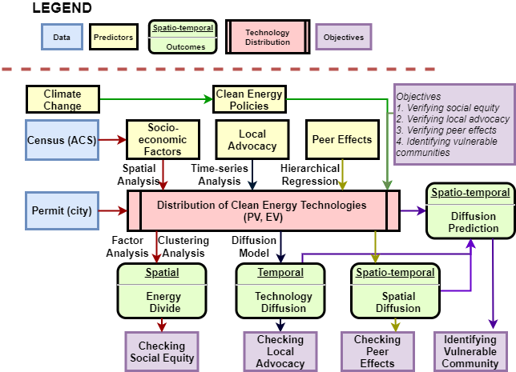

```{r setup, include=FALSE}
knitr::opts_chunk$set(echo = F, warning=FALSE, message=FALSE,
                      fig.path = "figs",
                      fig.align = "center",
                      fig.width = 4, 
                      fig.height = 4, 
                      dev = "png",
                      cache = FALSE)
```

```{r library, echo = FALSE, message = FALSE}
library(tidyverse)
library(broom) 
library(knitr)
library(readxl)
library(kableExtra)
```


# Abstract {#index}

The recent global climate change has led to the development of various clean energy policies and technologies. Clean energy technologies are proven to increase resilience in response to the impacts of climate change in addition to their economic, health and environmental benefits. However, two main concerns have emerged with the current rapid transition of energy systems toward clean energy technologies. 

First, the transition can inadvertently result in the uneven distribution of clean energy technologies, and accordingly has potential to disproportionately influence how communities respond to any undesirable climate change-related events. Such uneven distribution of new energy systems could be described as the “energy divide” (inequalities in access to energy services) which is similar to the “digital divide” in the late 20th century where uneven distribution of telecommunication infrastructure caused issues in social equity, which aims atto provide equal opportunities to people regardless of who they are and where they live. To make matters worse, having more distributed clean energy technologies requires improvement of the grid system leading to higher electricity bills as a form of regressive taxation to low-income households, who may not have access to these technologies. 

Second, reliability of the power supply for the community can inadvertently be affected by intermittent power generation of photovoltaic systems (PV) and uncertain charging schedules of electric vehicles (EV). This increases challenges to system operators requiring improved forecasting, new operating tools ensuring stability and coordination between systems. This is especially true for regions with higher decentralization trends due to the lack of active generation and demand connected as the regions require more diverse and less correlated power sources, energy storage and demand participation. In response to these two concerns, this study aims to study diffusion dynamics of clean energy technologies (PV and EV) in the residential built environment. The objectives of the proposed study include:

1.	To investigate the current status of distribution of clean energy technologies (PV and EV) and their relationships with socioeconomic and built environment characteristics of local communities (i.e., based on census tracts); 
2.	To validate the diffusion patterns of PV and EV;
3.	To identify local advocacy, peer effects and spillovers on diffusion trends; and 
4.	To develop a robust spatiotemporal prediction model based on the identified factors. 

The study identifies socially and technically vulnerable communities with regards to the uneven and unbalanced distribution of clean energy technologies (PV and EV) in consideration of resilience against climate change and reliability of energy systems. Therefore, the study will help policy makers to better support underserved communities with limited resources by devising equitable clean energy policies. As a result, it will promote desirable distribution in consideration of appropriate boundaries of reliable electrical systems in regard to clean energy technologies. Figure 1 summarizes the research framework of the proposed study. 


```{r fig.align = 'center', out.width = "75%", fig.cap = "Research Framework "}

```


# 1. Social Equity in Clean Energy Policies 

## Problem Statement

Clean energy technologies have been introduced and utilized all over the world for resilient and sustainable energy systems in response to climate change. This rapid transition to the new energy system could lead to undesirable impacts on some communities as shown in the case of telecommunication where the *digital divide* has excluded vulnerable groups of people from knowledge-based societies and economies (Chen and Wellman 2004). In fact, the European Union (EU) has already experienced that the uneven deployment of energy poverty and socioeconomic characteristics are correlated and the spatial and social distribution of this relationship is highly uneven (Bouzarovski and Tirado Herrero 2017). In this context, it is important to review how residential PV and EV are spatially distributed with a goal of understanding the spatial trends of how clean energy policies and incentives have been implemented. This can help identify issues related to social equity; that is, such uneven distribution may indicate particular communities being left out from the recent development of clean energy technologies, particularly those who are more vulnerable to the impacts of climate change.

## Literature Review

The Clean Energy Transformation Act (CETA) was signed into law by the Governor of Washington in 2019 to remove greenhouse gas emission from electricity supplies by 2045. It plans to eliminate coal power plants by 2025, at least 80% of electricity should be renewable or non-emitting while up to 20% could be and alternative compliance option, and finally 100% of electricity should be renewable or non-emitting by 2045. Furthermore, RCW 19.405.120 focuses on low-income energy assistance by requiring utilities in Washington to provide energy assistance funding and programs to low-income households from July, 2021. Furthermore, RCW 19.405 aims at equitable distribution of benefits:

> “..ensure that all customers are benefiting from the transition to clean energy: Through the equitable distribution of energy and non-energy benefits and reduction of burdens to vulnerable populations and highly impacted communities; long-term and short-term public health and environmental benefits and reduction of costs and risks; and energy security and resiliency.” - RCW 19.405.030(8)

The purpose of energy assistance is to reduce the energy burden of utility customers for weatherization and ownership in distributed energy resources (RCW 19.405.020(15)). In this regard, the Washington State Department of Commerce (DoC) will investigate the demographic characteristics of households and housing characteristics served by energy assistance funding and programs (RCW 19.405.020(3)(a)). 

While local governments started to enact policies in consideration of the equitable distribution of energy and its benefits, they are still in the early stage of evaluating clean energy technologies. Therefore, it is imperative to address concerns and issues associated with social equity related to energy access, affordability, security, etc. (i.e., "energy justice"). Energy policies have been dealing with only one portion of the entire energy system while an energy system requires multi- and trans-disciplinary based on practices of integration (Heffron and McCauley 2017). ‘Systems’ thinking was suggested including energy’s externalities for transition to low-carbon sources spanning resource mining, transmission, and waste in social, economic, and environmental impacts (Jenkins et al. 2016). 

In this regard, energy justice has been discussed in terms of affordable energy, energy security, fuel poverty, energy vulnerability on distributional unfairness, and politics of energy infrastructure (Fuller and McCauley 2016). Energy justice has been further framed from environmental and climate justice. Energy justice from an inter-disciplinary perspective has recently received significant attention from justice scholars (Jenkins et al. 2016). As a result, energy justice has been conceptualized as one specific academic fields in energy with the concern of equal distribution of costs imposed on communities and benefits from the access of the modern energy in addition to procedures of inclusive decision making (Sovacool et al. 2015). Heffron and McCauley (2017) introduced restorative justice to apply in practice through environmental impact assessments (when a project is designed or built), social-license-to-operate (with local communities over the life-span of the energy infrastructure), and energy financial reserve obligation to ensure the financial capacity to end the energy infrastructure. The authors suggested more just energy trilemma — economics, politics in terms of energy security, and environment for climate change mitigation — targeting on energy law and policy for energy justice. Green investment funds is an example for this energy trilemma (Heffron and McCauley 2017). 

Sovacool and Dworkin (2015) discussed eight principles of a decision-making tool: (1) availability for energy security of supply; (2) affordability such as stable prices; (3) due process of stakeholder's participation in policy making process; (4) good governance with information, accountability, and transparency; (5) sustainability, i.e., meeting the needs of the present without compromising the needs of future generations; (6) intergenerational equity for present and future generations; (7) intragenerational equity for different communities' access to energy; (8) and responsibility for the environment, climate change, future generation, and non-human species. Moreover, as a decision-making tool for energy justice, Sovacool et al. (2017) suggested two more principles: resistance, which is standing up to injustice, and intersectionality which is intertwined with socioeconomic, political and environmental factors. 

Bouzarovski and Simcock (2017) addressed the lack of geography in consideration of the injustice of energy poverty in terms of spatial justice, the geographical dimensions of inequality and inequity. Spatial justice was discussed in regard to landscapes of material deprivation for infrastructure and the built environment; geographic underpinnings of energy affordability (i.e., energy prices and household incomes); vicious cycles of vulnerability as poor health occurs due to material and socioeconomic spatial inequalities; and spaces of misrecognition, which is defined by recognition injustice through ignoring certain groups, affecting household practices. They claim energy transitions are generators of geographically uneven social, political and environmental displacements leading to vulnerability of particular groups (Bouzarovski and Simcock 2017).

Distributed energy systems have potential to reduce energy poverty (Sovacool et al. 2014) that can help promote social equity. In regard to distribution of energy production, the uneven distribution of production facilities has mainly been framed in environmental justice while an affordable energy access has been framed in terms of income equality and low carbon transitions for energy consumption (Fuller and McCauley 2016). Moreover, proper distribution (distributive justice or redistribution) and impartiality in decision-making (procedural justice and empowerment) are interconnected in that energy justice should be first considered for those that the policies are intended to benefit (Sovacool and Dworkin 2015).

Previous studies have found factors or drivers to the diffusion of clean energy technologies such as socioeconomic characteristics, built environment, peer effects, climate, local regulations and policy variables - spatial neighboring effects, built environment, and policy variables (Graziano and Gillingham 2015); higher income, home owners (Keirstead 2007); home ownership and neighborhood effects (Hofierka et al. 2014); owner occupation, single family versus multifamily development, suburban and rural location, preexisting PV installations (Graziano and Gillingham 2015); population density, single family home (Muller and Rode 2013); additional installation in neighborhood, stronger peer effect (Bollinger et al. 2012); Peer effects such as imitation, herd behavior, and social interaction (Scott et al. 2011); transaction cost such as time spent on negotiating (Seel et al. 2014); and solar irradiation (Schaffer and Brun 2015). 

The previous empirical analyses confirm that currently, there are communities not receiving the benefits of clean energy technologies while having cost burden to adopt these technologies. This raises an issue of social justice on the current distribution of clean energy technologies in present clean energy policies. For example, rebates, tax credits, production performance credits, property tax exemptions, and sales tax exemptions are forms of regressive taxation benefiting wealthier households by taxation on populations including low-income households which led to energy inequalities (Poruschi et al. 2019). Opportunities to take part in incentives are hard for those who cannot afford to invest in clean energy technologies. In this regard, a comprehensive, multi-scalar strategic approach spanning the whole energy system in regard to the life cycle is suggested as a less regressive means than carbon taxes or flat levies on energy bills for equity (Bouzarovski and Simcock 2017). 

## Methodology 

While a number of studies have investigated various aspects of the policies designed to support residential rooftop PV system (hereafter PV) and residential EV (hereafter EV) charger installations, there is still a dearth of studies aimed at investigating the impact of such policies on social equity. Two unanswered questions have emerged: 

(1) Are there certain communities inadvertently left out from incentive opportunities? 
(2) What is the impacts of current policies on social equity in clean energy technologies? 

To answer these questions, this study aims to perform a spatial analysis of the distribution of PV and EV charger installed buildings in terms of built environment and socioeconomic characteristics based on census tracts in Seattle, WA. In particular, this study aims to explore patterns of residential structures (single-family and multi-family housing) regarding PV and EV chargers by examining spatial clustering and relationships among variables. The examined data entails socioeconomic and built environment characteristics based on the 2015 American Community Survey (ACS). 

* Task 1: Map clean energy technologies (PV and EV) to verify distribution patterns
* Task 2: Find the latent variables of built environment and socioeconomic characteristics using Factor Analysis
* Task 3: Verify the suitability of the latent variables to the distribution of PV and EV using clustering analysis
* Task 4: Find the significant factors of the distribution patterns using  a spatial regression model
* Task 5: Find the vulnerable communities to each latent variable using geographically weighted regression (GWR)
* Task 6: Assess the social equity in the distribution of clean energy technologies. 


This study focuses on the City of Seattle open data portal which keeps the records of electrical permits issued between 2003 and 2019 in the city. Electrical permits are required when home owners install PV and EV chargers on their properties. The present study employed advanced data mining techniques to identify the installations of PV and EV chargers among the data sets. The data includes geographical coordinates (latitudes and longitudes), dates of the PV and EV charger installations, and PV and EV charger contractors who installed the systems. Mapping the points of PV and EV chargers allows the identification of their spatial patterns. 

The expected rates of PV and EV chargers per each census tract are estimated based on the total number of housing units and their respective residential PV and EV charger numbers. Standardized Installation Ratio (SIR) is defined by $Y_i$, the number of PV and EV chargers over $E_i$, the expected number of residential PV and EV chargers given the estimated proportion. In this context, SIR refers to the total number of PV and EV chargers over the total number of housing units.

$$ SIR_i = \frac{Y_i}{E_i} $$

A Moran’s I test identifies the global clustering in the distribution of the rates of residential PV and EV chargers. A very small p-value confirms that the PV and EV charger rates across census tracts are clustered. This clustering trend can be alleviated by fitting a model with appropriate covariates having similar spatially distributional characteristics. In this context, socioeconomic and built environment characteristics are examined to identify the most proper covariates. Having verified that there is a spatial pattern in the PV and EV charger installation rates, there might be related or shared latent variables in the socioeconomic and built environments in the region.

K-means clustering analysis are performed to identify communities similar in terms of socioeconomic and housing patterns in the region. It should be noted that K-means clustering does not take into account the PV and EV charger installation rates to define the Euclidean distance among data points, clustering of groups is determined only by the latent variables. This will help to characterize the difference among the clustered groups for PV and EV charger distributions.

A Poisson log-normal spatial model is run to address any residual clustering issues using a Bayesian method, Integrated Nested Laplace Approximations (INLA), which combines Laplace approximations and numerical integration in a very efficient manner. INLA enables Generalized Linear Mixed Models (GLMMs) to address temporal and spatial error terms. Furthermore, an Intrinsic Conditional Auto-Regressive (ICAR) model addresses spatial autocorrelation.

$$
\begin{aligned}
Y_i |\beta_{0},\beta_{1},\beta_{2},\beta_{3},S_i,\epsilon_i & \sim_{ind} \mbox{Poisson}(E_i \mbox{e}^{\beta_{0}+\beta_{1}X_{1i}+\beta_{2}X_{2i}+\beta_{3}X_{3i}} \mbox{e}^{S_i + \epsilon_i}),\\ 
\epsilon_i | \sigma_\epsilon^{2} & \sim_{iid} \mbox{N}(0,\sigma_\epsilon^{2}),\\ 
S_1,...,S_n | \sigma_s^{2} & \sim ~~~ \mbox{ICAR}(\sigma_s^{2}). 
\end{aligned} 
$$
where, $Y_i$ is the number of PV or EV chargers, $E_i$ is the expected number of PV or EV chargers, $X_{1i}, X_{2i}$ and $X_{3i}$ are the covariates, $S_i$ is the spatial random effect and $\epsilon_i$ is the non-spatial random effect in terms of a census tract i.

Geographically Weighted Regression (GWR) is used to address the local variation of coefficients of predictors by taking into account the local spatial dependency in order to locate regions more sensitive to each predictor.

$$
\begin{aligned}
Y(s) = E(s)\mbox{e}^{(\beta_{0}+\beta_{1}(s)X_1(s)+\beta_{2}(s)X_2(s)+\beta_{3}(s)X_3+\epsilon(s))}
\end{aligned} 
$$
where, $\beta_1$ and $\beta_2$ are coefficient estimators, and $X_{1}$  and $X_{2}$  are the covariates in terms of a census tract s.

# 2. Peer Effects on Diffusion (PV and EV)

## Problem Statement 

Washington State CETA features social justice and assistance to low-income households. It aims at not only equitable distribution of benefits, reduction of burdens to vulnerable communities, but also public health improvement, environmental benefits, and energy resilience. Furthermore, CETA requires that all utilities in the state implement energy assistance funding and programs to low-income households by means of bill reductions and weatherization, energy efficiency, and ownership in distributed energy resources such as PV. To that end, it is important to investigate how clean energy policies, programs, or campaigns affect diffusion of clean energy technologies in different communities. 

Distribution patterns of clean energy technologies such as PV may not be explained by economic profitability alone such as solar insolation, electricity bills and financial incentives (Karteris and Papadopoulos 2012). There are other drivers affecting the  adoption of such technologies. For example, local regulations, home ownership and peer effects also explain the distribution patterns (Hofierka et al. 2014, Graziano and Gillingham 2015). Behavioral factors such as social contagion or peer effects were found to be drivers for the diffusion of PV in addition to financial drivers resulting from the advent of grid parity (Curtius et al. 2018). Significant spatial spillover effects were also found between neighboring counties while the differences of economic incentive mainly influenced the spatial and temporal patterns of PV adoption (Dharshing 2016). While previous studies largely employed surveys to investigate the significance of peer effects, there is still a dearth of studies aimed at investigating the impact of peer effects on diffusion using objective data. Since social influence on decision making for the adoption of a new technology is underestimated (Nolan et al. 2008), the current study is based on a premise that the diffusion of clean energy technologies is impacted by non-financial factors such as local advocacy, spatial peer effects (SPE) and spillovers. In this regard this study will investigate how peer effects and local knowledge mobilization affects diffusion. In particular, spillover effects (social contagion) and local advocacy on diffusion of technologies will be addressed. 

## Literature Review

Social influence affects the diffusion of clean energy technologies. Wolske et al. (2018) discussed strategies in behavioral economics and psychology that increase the financial appeal of PV. They found underlying consumer motivations and predispositions such as perceived social support and consumer innovation are more significant as the primary factors than behavioral economics and psychology. Once the market is matured, the factors that influence consumer's decision making shift (Heiskanen and Matschoss 2017). Therefore, they assumed that if the PV market is matured, the gain/loss frame, perceived temporal distance and clarity of marketing claims may have stronger influences on consumer decisions. Furthermore, importance of perceived social support and peer effects were addressed by highlighting pro-PV opinion leaders, hosting workshops and connecting consumers with PV adopters in the community (Noll et al. 2014). Curtius et al. (2018) stressed the social influences on the decision to adopt PV by suggesting snowball effects which facilitate the creation of regional hot spots rather than the shotgun approach of uniform nationwide incentives. 

To investigate how and why peer effects work on the decision to adopt, descriptive norms explain what people typically do as people confirm these norms especially under the condition of high uncertainty (Nolan et al. 2008). In addition, injunctive norms suggest what people approve as socially expected. They found the number of PV installation as a descriptive norm affected PV adoption through social pressure (mediator or the injunctive norm). A higher number of PV installations in a neighborhood resulted in stronger social pressure as well as greater intentions to install PV.

Peer effects can be discussed by the strength of interpersonal ties and geographical proximity (Curtius et al. 2018). Furthermore, it has temporal aspects as adoption increases with the existence of previous PV (Bollinger and Gillingham 2012). Peer effects and local organizations promoting PV were found to be the most important local factors to PV diffusion (Palm 2017). Ryan (2017) performed a survey PV adopters in higher diffusion municipalities compared with lower diffusion municipalities. Neighboring effects on diffusion of clean energy technologies refer to externalities in which the characteristics or actions of a reference group affect an individual’s behavior or outcomes (Ryan 2017). Peer effects on diffusion of clean energy technologies could be investigated by spillover effects between neighboring communities or in terms of individual’s surrounding local built environments. Muller and Rode (2013) discussed peer effects based on spatial and temporal distance between installations. Brudermann et al. (2013) found word of mouth and informative meetings were significant factors for diffusion. 

As PV is normally installed on the rooftop, visibility of PV could affect a neighbor’s decision on PV adoption. In this regard, visibility of clean energy technologies could be considered to be passive peer effects while positive word of mouth is categorized as active peer effects. Scott et al. (2011) discussed peer effects in terms of imitation, herd behavior, and social interaction with the term "active" for solar advocacy and "passive" for visibility in a neighborhood. Regarding the local advocacy, Curtius et al. (2018) suggested co-investments with local authorities, public–private partnerships (PPP), or solarize campaigns. Both active and passive peer effects were also found to influence PV adoption in Texas (Rai and Robinson1 2013). 

Spatial models offer insights into spatial dynamics of the diffusion of innovations (i.e., clean energy technologies) that promote policies aimed at enabling transition to a low carbon economy that is just, efficient, and effective (Balta-Ozkan et al. 2015). The authors added that ignoring spatial dependence leads to biased and inconsistent estimate and loss of efficiency. Graziano et al. (2019) addressed spatial peer-effects (SPEs) and spatial spillovers regarding the built environment and jurisdictional boundaries with cross-sectional (OLS), panel (temporal), and spatial models. Spatiotemporal, built environment, socioeconomic variables including SPE with spatial factors within 0.5 to 4 miles were analyzed in addition to addressing spatial spillovers using a spatial autoregressive (SAR) model, a special case of the general spatial Durbin model (SDM). They found SPE decays as time passes and distance increases depending on the built environment. 
 
Local agencies have been playing an important role in regard to local advocacy or active peer effects. For example, Solarize Northwest is a community-driven, neighborhood group purchase campaign from Spark Northwest (Northwest Sustainable Energy for Economic Development), a 501(c)(3) non-profit organization aimed at creating communities of locally-controlled clean energy by solarize campaigns in cooperation with community organizations, solar contractors, utilities, city governments, and solar lenders. Communities take part in the program by attending workshops, getting site assessments, and contracting for installation. The local communities with the installed PV by the local advocative campaign in Seattle are as below. 


* January-April 2011 Queen Anne 30 Queen Anne homes for 130 kilowatts 
* July-October 2011 Magnolia 29 Magnolia homes for 114 kilowatts 
* January-April 2012 NE 52 Northeast Seattle homes for 246 kilowatts 
* January-April 2013 NW 141 Northwest Seattle homes for 640 kilowatts 
* July-October 2013 Central/ SE 185 homes for 885 kilowatts 
* July – October 2014 SW 111 homes for 684 kW

With financial incentives, peer effects will achieve diffusion in the targeted communities as peer effects play an important role in the early adoption stage of S-shaped diffusion curve (Rogers 1962) while it is uncertain for the matured market.

## Methodology 

This study aims to investigate the impact of Solarize Northwest campaign on diffusion in Seattle by using time series analysis including interrupted time series (ITS). The study results are expected to verify the impact of the campaign (local advocacy or active peer effects) on communities with respect to diffusion of PV and EV in Seattle. In addition, passive peer effects on diffusion of clean energy technologies will be also investigated to understand how the visibility of PV and EV can influence diffusion of the technologies by using multilevel models. The questions this study tries to answer are: 

(1) Does a local advocacy campaign or active peer effects affect diffusion of PV and EV? and 
(2) Do passive peer effects (visibility of neighborhood PV) affect diffusion in the community?

This study employs an interdisciplinary approach using time series models and multilevel models in a spatio-temporal data analyses. The following five tasks describe the workflow. 

* Task 1: Aggregate the census tract data to neighborhood to identify trends of diffusion
* Task 2: Find diffusion trends of clean energy technologies (PV and EV) for each neighborhood over 2009 - 2019 (spatio-temporal data analysis)
* Task 3: Analyze local advocacy campaign or active peer effects on diffusion using time series models
* Task 4: Analyze passive peer effects through visibility of neighborhood PV on diffusion using multilevel models
* Task: 5: Construct a spatio-temporal diffusion model to explain the peer effects on diffusion 

ITS evaluates the interventions which is introduced at a population level over a clearly defined time period and that target the reference population outcomes. This analysis is suitable for a continuous sequence of observations over time with respect to the intervention which differentiates pre-intervention and post-intervention period. The outcome should be available after the intervention and the time intervals should be equally spaced over the study duration. Different models will be used for single and multiple groups. Single group analysis will investigate the impact of the intervention on diffusion of PV in Seattle, while multiple group analysis will have the same goal while employing EV or diffusion trend of PV on another community as a control group to verify the impact of the intervention. The equation is as follows. 

$$
\begin{aligned}
Y_t = \beta_{0}+\beta_{1}T_t+\beta_{2}X_t+\beta_{3}T_tX_t+\epsilon_t,
\end{aligned} 
$$

where, T = the time elapsed since the start of the study; X = a dummy variable indicating the pre‐ or the post‐intervention period ;Y= the outcome at time;$\epsilon$ = estimates the error; $\beta_0$ = estimates the base level of the outcome at the beginning 
of the series; $\beta_1$ = estimates the base trend; $\beta_2$ = estimates the change in level in the post‐intervention segment; $\beta_3$ = estimates the change in trend in the post‐intervention 
segment.

The equation for multiple group analysis is as follows. 

$$
\begin{aligned}
Y_t = \beta_{0}+\beta_{1}T_t+\beta_{2}X_t+\beta_{3}T_tX_t+\beta_{4}Z+\beta_{5}ZT_t+\beta_{6}ZX_t+\beta_{7}ZT_tX_t+\epsilon_t
\end{aligned} 
$$

where, Z = dummy variable for group; $\beta_4$ = difference between the groups at the beginning time point; $\beta_5$ = difference between the groups in prior trend; $\beta_6$ = difference between the groups in change in level; $\beta_7$ = difference between the groups in change in trend. 

Multilevel models or hierarchical linear models are statistical models with measures at more than one level. In this study, individual households who installed PV were aggregated into a neighborhood level that leads to two hierarchical levels. The level 1 model is:

$$
\begin{aligned}
Y_{ij} = \beta_{0j}+\beta_{1j}X_{ij}+e_{ij},
\end{aligned} 
$$

where, $Y_{ij}$ = the outcome or the dependent variable for an individual observation at Level 1 (subscript i is for individual case and subscript j is for the neighborhood); $X_{ij}$ = the level 1 predictor; $\beta_{0j}$ = the intercept of the dependent variable in neighborhood j; $\beta_{1j}$ the slope for the relationship in neighborhood j; and $e_{ij}$ = the random errors of prediction for the level 1 equation. The variable of the number of PV around the individual household within a certain distance could be a predictor in the level 1 equation. 

In the level 2 regression equation, the dependent variables are the intercepts and the slopes in the lever 1 model: 

$$
\begin{aligned}
&\beta_{0j} = \alpha_{00}+\alpha_{01}W_{j}+u_{0j},\\
&\beta_{1j} = \alpha_{10}+u_{ij},
\end{aligned} 
$$

where, $\alpha_{00}$ = the intercept. This is the grand mean of the dependent variable across all the neighborhood when all the predictors are equal to 0; $W_j$ = the level 2 predictor; $\alpha_{01}$ =  the overall regression coefficient, or the slope, between the dependent variable and the Level 2 predictor; $u_{0j}$ = the random error component; $\alpha_{10}$ = the overall regression coefficient, or the slope, between the dependent variable and the level 1 predictor; and $u_{ij}$ = the error component for the slope. Neighborhood characteristics such as built environment could be predictors in the level 2 equation. 

# 3. Identifying Vulnerable Communities with Uneven Distribution in Spatiotemporal Aspects

## Problem Statement 

A resilient energy supply is important especially during emergency situations when, for example, medical services are in high demand. Furthermore, about 1.1 billion people lack access to electricity and an estimated investment of 52 billion USD per year is needed for the Sustainable Development Goals (SDGs) (IEA 2017). Lack of electricity differentially affects vulnerable people (e.g., patients). Hurricane Maria caused additional deaths in Puerto Rico in 2017, especially to those who relied on respirators powered by electricity (Robles et al. 2017). Maria perpetrated the longest blackout in US history, more than 100 days (Irfan 2018). Respiratory patients are more vulnerable to power outages and mortality and respiratory hospital admissions increased significantly during the blackout (Lin et al. 2011). These studies and reports suggest that  a resilient power supply is essential to protect those vulnerable communities. To that end, a decentralized energy network has the potential to improve energy accessibility and resilience, and has been increasing in size and use due to efficient end-use appliances and low-cost PV supported by information and communication technologies (ICT) and virtual financial services (Alstone et al. 2015). However, 1.3 billion people still lack access to electricity, and experience barriers to mobilize the decentralized energy networks to local level. 

While decentralized energy systems are improving resilience, the intermittent power generation of PV affects reliability of the power supply at the community level. This increases challenges to grid system operators because higher penetration and uneven distribution of PV and EV lead to challenges to the local electrical grid. Thus, access to clean energy technologies not only provide benefits of economy and resilience to communities, but also pose technical challenges to the local grid. First, the incurred costs of grid modernization increases burdens to underserved communities in the form of taxes and electric bills. Second, communities with higher decentralization trends need to address uncertain power generation schedule due to the lack of active generation and demand connectivity. As a result, communities need more diverse and less correlated power sources, energy storage and demand participation. Lastly, an electric network with higher decentralization trends requires improved forecasting technologies and new operating tools to ensure stability and coordination among transmission systems. This study aims to identify which communities are more vulnerable in terms of energy resilience in coming years due to lower access to clean energy technologies. In addition, as installations of PV and EV chargers are expected to increase, this study will also identify technically vulnerable communities which will require system investments.  

## Literature Review

Climate change and its impact on urban systems has raised questions of how to improve systems resilience especially related to energy. Energy resilience studies are still at an emerging stage and only a few studies have tried to actually define energy resilience. First, the common definition of resilience is discussed in terms of abilities in preparation, absorption, recovery, and adaptation to stressors. Sharifi and Yamagata (2016) addressed resilience in sustainability related dimensions: availability, accessibility, affordability, and acceptability. They found “preparation” in resilience ability and “availability” in sustainable dimensions to be the most critical considerations to addressing energy resilience. They added that “preparation” involves early adoption of planning and design measures to avoid potential disruptions in that preparation is most effective to improve resilience. Furthermore, they argue that reserve margins, diverse energy sources, and monitoring systems could improve “availability” of energy services (Sharifi and Yamagata 2016).

Vulnerability is defined as being at risk of having limited capacity to protect one’s interests. It is mainly interpreted in connection with weakness, dependency, powerlessness, deficiency, and passivity (Gilson 2013). This implicit bias leads to a problem in ethical response as it entails negative connotation (Gilson 2013). Furthermore, vulnerability could be discussed in two sources - “inherent” and “situational” (Mackenzie 2013). Inherent vulnerability is defined as peoples' neediness and dependence on others. This applies to energy dependency in modern society because energy is essential to the basic human needs to sustain life. Situational vulnerability is context-dependent such that the negative impact of energy poverty on a certain community, would be different from the impact on other communities, depending upon social, political, economic, and environmental situations. For example, effects of hurricane would be lower in a community with more resilient energy systems. Thus, it is important to discuss characteristics of resilient energy systems in terms of energy dependency and social, political, economic, and environmental situational conditions.

Community resilience may increase due to integrated energy diversity and decentralization of energy supply. Two emerging characteristics for energy resilience were presented by Lin and Bie (2016): integrated energy system (IES) and distributed energy resources (DERs). IES features inter-dependency and diversity while DERs represent energy sources spread across regions by being decentralized using technologies such as micro-grids. Integration of interdependent infrastructures such as energy, water, and telecommunication, can also lead to better mitigation in response to extreme weather (Zimmerman et al. 2017). This study suggested that when systems are combined, the complexity can become characterized and the emergent behavior of the system becomes hard to be expected. In the study, two measures for energy resilience were introduced: hardware hardening and operational resilience strategies. Hardware hardening is costly and influences a limited part of the whole system leading to less effectiveness. On the other hand, increasing diversity of energy supply, would increase system resilience (Zimmerman et al. 2017).

Understanding inter-dependencies of infrastructures are essential to address vulnerability. For instance, Wang and Reed (2017) showed that inter-dependencies in infrastructures are important to a system resilience. Furthermore, their study suggested that using community-level micro-grids would increase robustness of the energy system in addition to hardening the structure of power delivery components and increasing power generation redundancy. Furthermore, homogeneous and sole energy production systems can not only adversely affect communities with the lack of diverse energy supply, but also harm the social and environmental value of the built environment. For example, Shahidehpour et al. (2017) suggested centralized energy production may have contributed to vulnerability of the current urban form because most subsystems of human activities were relying on the sole energy production. Thus, controllable and islandable micro-grid systems (decentralized systems) would improve the resilience of power grids in extreme conditions.

Energy transition to decarbonization resulting from climate change requires demand side participation, battery storage, and decentralization in response to variable renewables. Without consideration of the cost-reliability tradeoff, going 100% renewable would produce higher energy cost and lower reliability due to the characteristics of variability of renewable energy sources. For example, higher uptake of PV is a challenge to network operators to keep enough capacity and voltage for stable energy supply (Balta-Ozkan et al. 2015). These reliability issues in supply-demand balance result from the fact that renewables do not have active generation and demand connected (ESIG 2019). This affects energy planning and operation. Energy planning takes into account resource adequacy to ensure the demands of capacities (system, local and flexible) are met. Power plants get paid by providing those capacities. As more distributed power sources are deployed, more diverse and less correlated power sources, storage and demand participation are needed. While adequacy is a planning challenge, flexibility and the provision of energy services are an operational challenge that requires probabilistic mindset, distributed energy storage, data analytics and coordination between systems. Furthermore, with respect to the market, price volatility due to variable renewables requires investment for flexibility. In addition, voltage and frequency control should be managed carefully as renewables are non-synchronous with no inherent inertial response. Change in the synchronous nature of an electricity system will affect the core technology of the current power infrastructure with its control and protection (ESIG 2019). 

Deregulation may lead to less grid reliability with increased competition, which prevented some states from market restructuring or deregulation (Michaud 2018). Likewise, increasing renewables in the grid affects grid reliability as well raising the issue of hosting capacity. Hosting capacity is the amount of distributed PV (DPV) that can be added to distribution system before control changes or system upgrades are required to safely and reliably integrate additional DPV. A number of factors influencing hosting capacity of a DPV system require consideration, such as whether advanced inverter settings are utilized, the system size, and where it is located on the circuit. The characteristics of DPV system includes the location and time-varying behavior of all distributed energy resources and the existing equipment on a circuit. As the system configuration evolves over time depending on investments made by utility companies, DPV owners or developers, distribution planning practices are important especially when upgrades or other mitigation against the impacts of having more renewables are required (Dubey et al. 2015). 


EV features battery storage and demand side participation with the grid because it could be employed for load balancing via smart charging with Vehicle to Grid (V2G) technology. Yamagata et al. (2016) tried to analyze several algorithms to find the optimal clustering of communities in terms of self-sufficiency, sharing cost, and stability. The concept of V2C (vehicle to community) was introduced in the study with respect to tradeoff between implementation and maintenance cost, and electricity self-sufficient for community based energy networks. In this context, DER adopter analysis of different technologies (PV, EV, and HVAC) was discussed by comparison of distribution patterns and aggregating scales (Heymann et al. 2019). The authors suggested to consider uneven distribution for electricity network planning with respect to the investment plan for EV and PV with different distribution patterns. They argued that the difference of EV and PV adoption for energy policy design in consideration of synergies and distributional justice should be considered as it will help design DER support schemes for maximizing penetration and reducing network expansion costs (Heymann et al. 2019). 

Furthermore, PV self-consumption will lower medium voltage distribution grid losses and investments in cables and transformers (Litjens et al. 2018). In addition, overloading may occur on medium voltage grids due to the increase of PV, EV, and electric heating (Sijm 2014). In this regard, higher levels of PV self-consumption may decrease stress on the grid thus ease integration of PV in the existing infrastructure (van der Kam and van Sark 2015). This study suggested self-consumption by energy storage and demand side management (DSM) by establishment of the geographical misfit between EV and PV diffusion and the impact on energy systems. They found EV diffusion lags behind PV diffusion led to different supply and demand patterns for different regions which require different grid architectures (van der Kam and van Sark 2015).


## Methodology 

Installations of PV and EV chargers are expected to increase and lead to challenges to the local electrical grid with respect to the reliability of power supply. To that end, it is important to identify vulnerable communities in terms of rates of technology penetrations in different communities. The emerging questions are: 

(1) What are predicted future trends of diffusion of PV and EV in each community?
(2) Where are technically vulnerable communities with respect to rapid increases of PV and EV? 

For these questions, this study aims to apply machine learning techniques to predict diffusion of clean energy technologies in consideration of socioeconomic, built environment characteristics and peer effects. The predicted diffusion will identify socially and technically vulnerable communities in terms of diffusion of clean energy technologies.

* Task 1: Verify the importance of identifying communities with higher decentralization trends
* Task 2: Identify methods to best predict the diffusion of clean energy technologies in consideration of the identified factors: socioeconomic, built environment characteristics and peer effects
* Task 3: Develop a robust prediction model to identify vulnerable communities with regards to clean energy technology distribution
* Task 4: Validate the prediction model in case studies and evaluate the impact of the different diffusion rates of clean energy technologies


Based on features such as socioeconomic and built environment characteristics and peer effects, the development of a prediction model will involve linear regression models with Ridge, Lasso, and Elastic net regressions. Regularization is necessary to avoid overfitting which leads to a higher variation when applying the model to other data sets. It is bias-variance tradeoff that a localized model is hard to be generalizable. Regularization helps to avoid overfitting by adding a penalty term to the loss function. A penalty term prevents model parameters (feature weights) from becoming larger. The best model can be identified in terms of accuracy and root square mean error (RSME).

There are several machine learning algorithms available for this study. For example, a support vector machine (SVM) separates data using a hyper-plane which is defined by support vectors or the nearest observations. Depending on the tolerance of margin violations, there are soft and hard margin classifications. An SVM regressor with Gaussian radial basis function (RBF) kernel is a special form of SVM that has higher dimensional feature vectors. There are several kernels such as polynomial and sigmoid. The benefit of kernel is that the classifier can be flexible enough to separate data without involving additional features. A random forest model features entailing randomness when training a model, which promotes diversity, leading to a better model performance. This algorithm is an ensemble of decision trees that try to separate data into homogeneous groups by setting thresholds. Extra-trees even randomize the thresholds to have a more diverse environment for the model to be trained. A gradient boosting model fits data and then keeps fitting the residuals in sequence by adding predictors. These algorithms have several hyper-parameters that could be searched for the best model performances by using modules such as randomizedSearchCV and gridsearchcv. All the models could be fitted with the optimal hyper-parameters found. 

Gradient descent is a generic optimization algorithm in machine learning. For example, to minimize a cost function $f(\theta)$, we start with an arbitrary point $\theta^{0}$ and repeat the algorithm until it is near the optimal point. The cost function could be different depending upon the context. The goal is the find the weights ($\theta$) which minimize the cost function. 

$$
\begin{aligned}
\theta^{k + 1} = \theta^{k} - \eta_k\nabla f(\theta^{k}) 
\end{aligned} 
$$

where, $\nabla f(\theta^{k})$ = the direction of steepest descent of f at a point $\theta$; $\eta_k$ = "step size" or "learning rate." $\theta^{k+1}$ has a better value than $\theta^{k}$. With each step of Gradient descent, the value function gets better. Eventually, the algorithm converges to a local minimum. 

<!-- 
# Time Schedule

```{r}
data <- read_excel("schedule.xlsx")
# View(data)

data %>% 
    kable(format = "latex", caption = "Research Schedule", booktabs = T, align = "llcc") %>%
    kable_styling(latex_options = c("striped", "hold_position", "scale_down")) 

```

-->

# Significance of Research and Contribution to Knowledge

This study has potential for significant implications to both energy policy analysis and electricity network planning as it involves social justice, public policy and urban planning. The present study will reveal social equity issues (i.e., certain communities are underserved) based on the uneven distribution of benefits and costs of clean energy technologies. Clean energy technologies play a role in community resilience because decentralized energy systems such as PV can improve resilience in response to climate change. Furthermore, energy diversity, in the context of diverse energy sources, would reduce risk to society, thus enhancing the stability of the built environment as biodiversity keeps ecosystem healthy and stable. This is because the diversification effect lessens the volatility or risk by having less correlated characteristics. Decentralized and diversified energy systems would enhance community resilience in response to climate change. Therefore, higher diffusion of clean energy technologies helps communities to be equipped with better resilience in addition to economic, health and environmental benefits. 

However, while there are benefits, adding more clean energy technologies to the grid has a reliability issue that result in costs. This is because the variable power generation entails a burden to the grid in terms of a reliable power supply. Handling variable power generation will incur costs for grid modernization necessary to deploy more clean energy technologies. Furthermore, system operators are technically required to have improved forecasting and new operating tools ensuring stability and coordination between systems (ESIG 2019). In addition, incentives such as tax credits and Feed-in Tariffs (FiTs) are forms of regressive taxation inequitably passing on the costs to underserved communities through taxes and increasing electric bills. Economic incentives have resulted in the uneven distribution of PV, lead to a redistribution of income by benefiting counties with favorable factors such as solar radiation (Dharshing 2017). Those incentives preferentially benefit wealthier households resulting in inadvertent relative increases in taxation on low-income households, further contributing to energy inequalities (Poruschi et al. 2019). Furthermore, multi-family and renter-occupied units — which are common in urban regions — have low participation or access to these incentives (Gillingham et al. 2012).

In short, the benefits and costs of diffusion of the clean energy technologies are unevenly distributed and introduce issues related to the reliability of the power supply, causing concerns in energy justice. Previous studies have suggested some measures to address social equity in the distribution of clean energy technologies. Dharshing (2017) suggested policies to take specific local measures to address imbalances in PV adoption. Leasing business was recommended to increase the adoption for less affluent households such as renters to join in the PV market  (Drury et al. 2012) and community solar (Funkhouser 2015). Wustenhagen et al. (2007) emphasized the local acceptance of renewables and community ownership to increase PV adoption. Furthermore, Goldthau (2014) suggested adoption of polycentric governance of energy infrastructures would promote resilient, decentralized energy systems. 

Furthermore, some studies argued social science would address the reliability issue. For example, Alstone et al. (2015) pointed out social science is necessary to provide reliable energy services and Goldthau (2014) suggested Social science would be helpful to provide the reliable energy services as polycentric governance is critically related to socioeconomic actors. In addition, Wang and Reed (2017) argued that social science involvement may be necessary to investigate the infrastructure resilience from the community perspectives in addition to the infrastructure operators’ perspectives. 

In summary, this study will address social equity related to diffusion of clean energy technologies in consideration of resilient and reliable energy systems. The present study will first perform empirical analyses of residential PV and EV chargers in Seattle, WA with two main sub-aims: (1) to verify if there are spatial patterns in the distribution of the clean energy technology installations, and (2) to determine which factors related to socioeconomic and built environment characteristics contribute to uneven distribution. Second, peer effects will be investigated to determine whether or not they significantly influence diffusion trends with spatio-temporal patterns. Third, a diffusion model will be developed based on PV and EV adoptions in Seattle and will be verified  with the identified factors and peer effects on diffusion of clean energy technologies. Lastly, vulnerable communities due to the uneven diffusion rates of PV and EV will be identified. The prediction model will estimate the future impact of clean energy technologies socially and technically on communities. 

This will help policy makers to better support underserved communities with limited resources (e.g., renters and low-income households that have less disposable income for PV and EV) by devising equitable policies in response to climate change. Furthermore, the study results will support policy makers and system operators to make informed investment decision on allocating energy distribution systems and scalable renewable energy infrastructures for vulnerable communities. 


# Reference 

*	Ajaz, W. (2019). “Resilience, environmental concern, or energy democracy? A panel data analysis of microgrid adoption in the United States.” Energy Research & Social Science, 49, 26–35.
*	Araújo, K., Boucher, J. L., and Aphale, O. (2019). “A clean energy assessment of early adopters in electric vehicle and solar photovoltaic technology: Geospatial, political and socio-demographic trends in New York.” Journal of Cleaner Production, 216, 99–116.
*	Augustine, P., and McGavisk, E. (2016). “The next big thing in renewable energy: Shared solar.” The Electricity Journal, 29(4), 36–42.
*	Baba, H., and Asami, Y. (2017). “Regional Differences in the Socio-economic and Built-environment Factors of Vacant House Ratio as a Key Indicator for Spatial Urban Shrinkage</b>.” Urban and Regional Planning Review, 4(0), 251–267.
*	Balta-Ozkan, N., Yildirim, J., and Connor, P. M. (2015). “Regional distribution of photovoltaic deployment in the UK and its determinants: A spatial econometric approach.” Energy Economics, 51, 417–429.
*	Bollinger, B., and Gillingham, K. (2012). “Peer Effects in the Diffusion of Solar Photovoltaic Panels.” Marketing Science, INFORMS, 31(6), 900–912.
*	Bouzarovski, S., and Simcock, N. (2017). “Spatializing energy justice.” Energy Policy, 107, 640–648.
*	Bouzarovski, S., and Tirado Herrero, S. (2017). “The energy divide: Integrating energy transitions, regional inequalities and poverty trends in the European Union.” European Urban and Regional Studies, 24(1), 69–86.
*	Brown, A. C. (2016). “The value of solar writ large: A modest proposal for applying ‘value of solar’ analysis and principles to the entire electricity market.” The Electricity Journal, 29(9), 27–30.
*	Brudermann, T., Reinsberger, K., Orthofer, A., Kislinger, M., and Posch, A. (2013). “Photovoltaics in agriculture: A case study on decision making of farmers.” Energy Policy, 61, 96–103.
*	Chan, G., Evans, I., Grimley, M., Ihde, B., and Mazumder, P. (2017). “Design choices and equity implications of community shared solar.” The Electricity Journal, 30(9), 37–41.
*	Chen, W., and Wellman, B. (2004). “THE GLOBAL DIGITAL DIVIDE – WITHIN AND BETWEEN COUNTRIES.” (7), 8.
*	Curtius, H. C., Hille, S. L., Berger, C., Hahnel, U. J. J., and Wüstenhagen, R. (2018). “Shotgun or snowball approach? Accelerating the diffusion of rooftop solar photovoltaics through peer effects and social norms.” Energy Policy, 118, 596–602.
*	Dharshing, S. (2017). “Household dynamics of technology adoption: A spatial econometric analysis of residential solar photovoltaic (PV) systems in Germany.” Energy Research & Social Science, 23, 113–124.
*	“Diffusion of innovations. BY Everett M. Rogers. The Free Press of Glencoe Division of The Macmillan Co., 60 Fifth Avenue, New York 11, N. Y., 1962. xiii + 367 pp. 14 × 21 cm. Price $6.50.” (1963). Journal of Pharmaceutical Sciences, 52(6), 612–612.
*	Drury, E., Miller, M., Macal, C. M., Graziano, D. J., Heimiller, D., Ozik, J., and Perry IV, T. D. (2012). “The transformation of southern California’s residential photovoltaics market through third-party ownership.” Energy Policy, 42, 681–690.
*	Dubey, A., Santoso, S., and Maitra, A. (2015). “Understanding photovoltaic hosting capacity of distribution circuits.” 2015 IEEE Power Energy Society General Meeting, 1–5.
*   ESIG. (2019). “Toward 100% Renewable Energy Pathways: Key Research Needs.” ENERGY SYSTEMS INTEGRATION GROUP.
*	Fuller, S., and McCauley, D. (2016). “Framing energy justice: perspectives from activism and advocacy.” Energy Research & Social Science, 11, 1–8.
*	Funkhouser, E., Blackburn, G., Magee, C., and Rai, V. (2015). “Business model innovations for deploying distributed generation: The emerging landscape of community solar in the U.S.” Energy Research & Social Science, 10, 90–101.
*	Gillingham, K., Harding, M., and Rapson, D. (2012). “Split Incentives in Residential Energy Consumption.” The Energy Journal, International Association for Energy Economics, 33(2), 37–62.
*	Gilson, E. (2013). “The Ethics of Vulnerability | A Feminist Analysis of Social Life and Practice | Taylor & Francis Group.” <https://www.taylorfrancis.com/books/9780203078136> (Jun. 13, 2019).
*	Goldthau, A. (2014). “Rethinking the governance of energy infrastructure: Scale, decentralization and polycentrism.” Energy Research & Social Science, 1, 134–140.
*	Graziano, M., Fiaschetti, M., and Atkinson-Palombo, C. (2019). “Peer effects in the adoption of solar energy technologies in the United States: An urban case study.” Energy Research & Social Science, 48, 75–84.
*	Graziano, M., and Gillingham, K. (2015). “Spatial patterns of solar photovoltaic system adoption: The influence of neighbors and the built environment.” Journal of Economic Geography, Oxford Academic, 15(4), 815–839.
*	Heffron, R. J., and McCauley, D. (2017). “The concept of energy justice across the disciplines.” Energy Policy, 105, 658–667.
*	Heiskanen, E., and Matschoss, K. (2017). “Understanding the uneven diffusion of building-scale renewable energy systems: A review of household, local and country level factors in diverse European countries.” Renewable and Sustainable Energy Reviews, 75, 580–591.
*	Heymann, F., Lopes, M., vom Scheidt, F., Silva, J. M., Duenas, P., Soares, F. J., and Miranda, V. (2019). “DER adopter analysis using spatial autocorrelation and information gain ratio under different census-data aggregation levels.” IET Renewable Power Generation.
*	Hirsch, A., Parag, Y., and Guerrero, J. (2018). “Microgrids: A review of technologies, key drivers, and outstanding issues.” Renewable and Sustainable Energy Reviews, 90, 402–411.
*	Hofierka, J., Kaňuk, J., and Gallay, M. (2014). “The Spatial Distribution of Photovoltaic Power Plants in Relation to Solar Resource Potential: The Case of the Czech Republic and Slovakia.” Moravian Geographical Reports, Sciendo, 22(2), 26–33.
*	Irfan, U. (2018). “Puerto Rico and the US Virgin Islands are in the longest blackout in US history - Vox.” <https://www.vox.com/energy-and-environment/2017/10/30/16560212/puerto-rico-longest-blackout-in-us-history-hurricane-maria-grid-electricity> (May 25, 2018).
*	Jean, N., Burke, M., Xie, M., Davis, W. M., Lobell, D. B., and Ermon, S. (2016). “Combining satellite imagery and machine learning to predict poverty.” Science, 353(6301), 790–794.
*	Jenkins, K., McCauley, D., Heffron, R., Stephan, H., and Rehner, R. (2016). “Energy justice: A conceptual review.” Energy Research & Social Science, 11, 174–182.
*	van der Kam, M. J., Meelen, A. A. H., van Sark, W. G. J. H. M., and Alkemade, F. (2018). “Diffusion of solar photovoltaic systems and electric vehicles among Dutch consumers: Implications for the energy transition.” Energy Research & Social Science, 46, 68–85.
*	van der Kam, M., and van Sark, W. (2015). “Smart charging of electric vehicles with photovoltaic power and vehicle-to-grid technology in a microgrid; a case study.” Applied Energy, 152, 20–30.
*	Karteris, M., and Papadopoulos, A. M. (2012). “Residential photovoltaic systems in Greece and in other European countries: a comparison and an overview.” Advances in Building Energy Research, Taylor & Francis, 6(1), 141–158.
*	Keirstead, J. (2007). “Behavioural responses to photovoltaic systems in the UK domestic sector.” Energy Policy, 35(8), 4128–4141.
*	Lee, M., Hong, T., Jeong, J., and Jeong, K. (2018). “Development of a rooftop solar photovoltaic rating system considering the technical and economic suitability criteria at the building level.” Energy, 160, 213–224.
*	Lin, S., Fletcher, B. A., Luo, M., Chinery, R., and Hwang, S.-A. (2011). “Health Impact in New York City During the Northeastern Blackout of 2003.” Public Health Reports, 126(3), 384–393.
*	Lin, Y., and Bie, Z. (2016). “Study on the Resilience of the Integrated Energy System.” Energy Procedia, 103, 171–176.
*	Litjens, G. B. M. A., Kausika, B. B., Worrell, E., and van Sark, W. G. J. H. M. (2018). “A spatio-temporal city-scale assessment of residential photovoltaic power integration scenarios.” Solar Energy, 174, 1185–1197.
*	Lukanov, B. R., and Krieger, E. M. (2019). “Distributed solar and environmental justice: Exploring the demographic and socio-economic trends of residential PV adoption in California.” Energy Policy, 134, 110935.
*	Mackenzie, C. (2013). “Vulnerability: New Essays in Ethics and Feminist Philosophy - Google Books.” <https://books.google.com/books?hl=en&lr=&id=6W9MAQAAQBAJ&oi=fnd&pg=PP1&dq=vulnerability+ethics&ots=CybV1ADLth&sig=fCvM7G6Oy-pW32O-Hkp3_22uhPw#v=onepage&q=vulnerability%20ethics&f=false> (Jun. 13, 2019).
*	Mah, D. N., Wang, G., Lo, K., Leung, M. K. H., Hills, P., and Lo, A. Y. (2018). “Barriers and policy enablers for solar photovoltaics (PV) in cities: Perspectives of potential adopters in Hong Kong.” Renewable and Sustainable Energy Reviews, 92, 921–936.
*	Martinopoulos, G., and Tsalikis, G. (2018). “Diffusion and adoption of solar energy conversion systems – The case of Greece.” Energy, 144, 800–807.
*	Michaud, G. (2018). “Deploying solar energy with community choice aggregation: A carbon fee model.” The Electricity Journal, 31(10), 32–38.
*	Muchunku, C., Ulsrud, K., Palit, D., and Jonker‐Klunne, W. (2018). “Diffusion of solar PV in East Africa: What can be learned from private sector delivery models?” WIREs Energy and Environment, 7(3).
*	Müller, S., and Rode, J. (2013). “The adoption of photovoltaic systems in Wiesbaden, Germany.” Economics of Innovation and New Technology, Routledge, 22(5), 519–535.
*	Nolan, J. M., Schultz, P. W., Cialdini, R. B., Goldstein, N. J., and Griskevicius, V. (2008). “Normative Social Influence is Underdetected.” Personality and Social Psychology Bulletin, SAGE Publications Inc, 34(7), 913–923.
*	Noll, D., Dawes, C., and Rai, V. (2014). “Solar Community Organizations and active peer effects in the adoption of residential PV.” Energy Policy, 67, 330–343.
*	Palm, A. (2016). “Local factors driving the diffusion of solar photovoltaics in Sweden: A case study of five municipalities in an early market.” Energy Research & Social Science, 14, 1–12.
*	Poruschi, L., and Ambrey, C. L. (2019). “Energy justice, the built environment, and solar photovoltaic (PV) energy transitions in urban Australia: A dynamic panel data analysis.” Energy Research & Social Science, 48, 22–32.
*	Rai, V., and Robinson, S. A. (2013). “Effective information channels for reducing costs of environmentally- friendly technologies: evidence from residential PV markets.” Environmental Research Letters, 8(1), 014044.
*	Robles, F., Davis, K., Fink, S., and Almukhtar, S. (2017). “Official Toll in Puerto Rico: 64. Actual Deaths May Be 1,052.” The New York Times.
*	Sánchez-Lozano, J. M., Teruel-Solano, J., Soto-Elvira, P. L., and Socorro García-Cascales, M. (2013). “Geographical Information Systems (GIS) and Multi-Criteria Decision Making (MCDM) methods for the evaluation of solar farms locations: Case study in south-eastern Spain.” Renewable and Sustainable Energy Reviews, 24, 544–556.
*	Schaffer, A. J., and Brun, S. (2015). “Beyond the sun—Socioeconomic drivers of the adoption of small-scale photovoltaic installations in Germany.” Energy Research & Social Science, 10, 220–227.
*	Scott, J., and Carrington, P. J. (2011). The SAGE Handbook of Social Network Analysis. SAGE Publications, London, UNITED KINGDOM.
*	Seel, J., Barbose, G. L., and Wiser, R. H. (2014). “An analysis of residential PV system price differences between the United States and Germany.” Energy Policy, 69, 216–226.
*	Shahidehpour, M., liu, xindong, Li, Z., and Cao, Y. (2017). “Microgrids for Enhancing the Power Grid Resilience in Extreme Conditions.” IEEE Transactions on Smart Grid, 1–1.
*	Shang, L., Lee, H. W., Dermisi, S., and Choe, Y. (2020). “Impact of energy benchmarking and disclosure policy on office buildings.” Journal of Cleaner Production, 250, 119500.
*	Sharifi, A., and Yamagata, Y. (2016). “Principles and criteria for assessing urban energy resilience: A literature review.” Renewable and Sustainable Energy Reviews, 60, 1654–1677.
*	Sijm, J. P. M. (n.d.). “Cost and revenue related impacts of integrating electricity from variable renewable energy into the power system - A review of recent literature.” 52.
*	Sovacool, B. K., Burke, M., Baker, L., Kotikalapudi, C. K., and Wlokas, H. (2017). “New frontiers and conceptual frameworks for energy justice.” Energy Policy, 105, 677–691.
*	Sovacool, B. K., and Dworkin, M. H. (2015). “Energy justice: Conceptual insights and practical applications.” Applied Energy, 142, 435–444.
*	Strupeit, L., and Palm, A. (2016). “Overcoming barriers to renewable energy diffusion: business models for customer-sited solar photovoltaics in Japan, Germany and the United States.” Journal of Cleaner Production, 123, 124–136.
*	Vithayasrichareon, P., Mills, G., and MacGill, I. F. (2015). “Impact of Electric Vehicles and Solar PV on Future Generation Portfolio Investment.” IEEE Transactions on Sustainable Energy, 6(3), 899–908.
*	Walter, R., Evans, A., and Atherwood, S. (2016). “Addressing the Affordable Housing Crisis for Vulnerable Renters: Insights From Broward County on an Affordable Housing Acquisition Tool.” Housing Policy Debate, 26(1), 123–149.
*	Walter, R. J., and Li, Y. (2014). “Moving to Opportunity? An Examination of Housing Choice Vouchers on Urban Poverty Deconcentration in South Florida.”
*	Wang, R., Walter, R. J., Arafat, A. A., Ding, X., and Naji, A. A. (2017). “Examining Neighborhood Opportunity and Locational Outcomes for Housing Choice Voucher Recipients: A Comparative Study between Duval County, Florida, and Bexar County, Texas: EXAMINING NEIGHBORHOOD OPPORTUNITY.” City & Community, 16(4), 421–446.
*	Wang, S., and Reed, D. A. (2017). “Vulnerability and Robustness of Civil Infrastructure Systems to Hurricanes.” Frontiers in Built Environment, 3.
*	Wolske, K. S., Todd, A., Rossol, M., McCall, J., and Sigrin, B. (2018). “Accelerating demand for residential solar photovoltaics: Can simple framing strategies increase consumer interest?” Global Environmental Change, 53, 68–77.
*	Wüstenhagen, R., Wolsink, M., and Bürer, M. J. (2007). “Social acceptance of renewable energy innovation: An introduction to the concept.” Energy Policy, 35(5), 2683–2691.
*	Xu, Y., Fu, C., Kennedy, E., Jiang, S., and Owusu-Agyemang, S. (2018). “The impact of street lights on spatial-temporal patterns of crime in Detroit, Michigan.” Cities, 79, 45–52.
*	Yamagata, Y., Murakami, D., Minami, K., Arizumi, N., Kuroda, S., Tanjo, T., and Maruyama, H. (2016). “Electricity Self-Sufficient Community Clustering for Energy Resilience.” Energies, 9(7), 543.
*	Zimmerman, R., Zhu, Q., de Leon, F., and Guo, Z. (2017). “Conceptual modeling framework to integrate resilient and interdependent infrastructure in extreme weather.” Journal of Infrastructure Systems, 23(4), 04017034.


